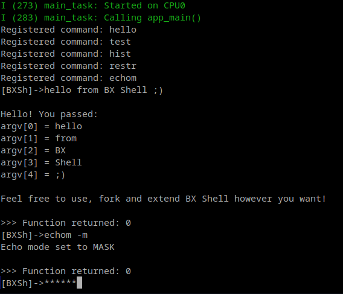

# BX Shell

**BX Shell** is a minimal and extensible ESP32 shell for ESP-IDF built entirely from scratch, and designed for ANSI-compatible terminals and communication over UART. It doesn't use `esp_console` and/or `linenoise`, or any third party shell framework. 

It depends on `cont` container object from a library I built earlier (separate repository: https://github.com/andrzejs-gh/CONTLIB), `input_line` object, specially crafted hash table object `ftable`, and a UTF-8 sanitizer, all built from scratch. 

By design it's a minimal shell environment, providing the user with basic commands for managing the console input/output, `input_line`, `ftable` objects and their APIs (+ their global instances used by the shell), and UTF-8 sanitization function. It's up to the user how they extend the shell.



---

## Table of contents
- **Main overview**
	- [TL;DR](#tldr)
- **Implementation and usage details**
	- [Built-in commands](#built-in-commands)
	- [Command registration](#command-registration)
 	- [Control keys and sequences](#control-keys-and-sequences) 
 	- [Arrow key assumptions](#arrow-key-assumptions)
	- [Input length](#input-length)
	- [UTF-8 sanitization](#utf-8-sanitization)
	- [History](#history)
	- [Command line and input_line object](#command-line-and-input_line-object)
 	- [Function table](#function-table) 

<p align="right">BACK TO 
<a href="#bx-shell">Top</a>
</p>

---

## TL;DR

### ** Navigation **

Standard control keys and sequences' byte implementation is defined in `/main/CONSTANTS.h`, and it can be tweaked to a specific terminal if needed (see [here](#control-keys-and-sequences)). However the shell assumes the most common terminal conventions for arrow key sequences sent by the terminal (see details [here](#arrow-key-assumptions)).

- **ENTER** - submit
- **CTRL + C** - discard and start a new line
- **LEFT ARROW** - move cursor one position left
- **RIGHT ARROW** - move cursor one position right
- **UP ARROW** - clear the line and insert previous entry from the history
- **DOWN ARROW** - clear the line and insert next entry from the history
- **CTRL + LEFT ARROW** - move cursor one word left
- **CTRL + RIGHT ARROW** - move cursor one word right

The command line is horizontaly scrolled once the input exceeds the terminal width.

<p align="right">BACK TO 
<a href="#tldr">TL;DR</a>
</p>

* * *

### ** Command registration and argument parsing **

You can register commands (more datailed description [here](#command-registration)) in 

`/main/FUNCTIONS/_FUNCTION_REG.h`

by adding the entry 

`{"command_name", function_name}`

exactly as [built-in commands](#built-in-commands) are registered.
The registered function needs to have the signature:
```c
int function_name(int argc, char** argv) 
```
Arguments are automatically parsed from the input with `argv[0]` = command name itself.

Registered functions live in the [function table](#function-table) (see global variable [commands](#-global-variables-)), which can be extended at runtime by new commands, and allows for overriding of the existing commands (see [ftable API](#API)). 

<p align="right">BACK TO 
<a href="#tldr">TL;DR</a>
</p>

* * *

### ** Input length, UTF-8 handling and echo modes **

The default maximum input length for a single command is 255 bytes (see [here](#input-length)). 
By default, the allowed UTF-8 character set is restricted to ASCII and almost all 2-byte characters (see [here](#utf-8-sanitization)). You can lift that restriction with `restr [on | off]` command (see details [here](#-restr)), though correct input handling and shell stability is not guaranteed in unrestricted mode.

The command line has 3 possible echo modes, which you can change between via `echom [-e | -m | -s]` command (see [here](#-echom)):
- ECHO (normal output, default setting, set with command `echom -e`)
- MASK (masked output, prints `*` instead of characters, set with command `echom -m`)
- SUPPRESS (suppressed output, doesn't print anything, set with command `echom -s`)

<p align="right">BACK TO 
<a href="#tldr">TL;DR</a>
</p>

* * *

### ** History **

If the command line is in ECHO mode, each entry is stored in the history. To navigate the history use up and down arrows, to display all stored entries use `hist` command. The default history capacity is set to 5 entries (see [here](#history)).

<p align="right">BACK TO 
<a href="#tldr">TL;DR</a>
</p>

* * *

### ** Display and current directory tracking **

If cwd pointer (see [global variables](#-global-variables-)) is `NULL`, the command line will be prefixed with a predefined title placed in 

`[]->`

by default it's:

`[BXSh]->`

(see here how you can [change the title](#command-line-title))

If cwd pointer references a directory string, command line will display that directory:

`[/some/directory]->`

<p align="right">BACK TO 
<a href="#tldr">TL;DR</a>
</p>

* * *

### ** Global variables **

The header `/main/GLOBAL_VARIABLES.h` exposes global variables:
- `cmd_line` - the instance of `input_line` object which serves as the main command line (see [here](#command-line-and-input_line-object))
- `commands` - instance of `ftable` hash table that holds all registered commands (see [here](#function-table))
- `fs_cwd` - pointer that can be used for storing the reference to a current working directory string, by default set to `NULL`

<p align="right">BACK TO 
<a href="#tldr">TL;DR</a>
</p>

* * *
* * *
* * *

## Built-in commands 

Built-in commands' functions (entry points) are all defined in `/main/FUNCTIONS/built-ins.h` and registered in `/main/FUNCTIONS/_FUNCTION_REG.h` (see registration details [here](#command-registration)).

**FULL LIST**:

### • hello
- command: `hello`
- entry point: 
```c 
int hello(int argc, char** argv) 
```
- arguments: 
    - arbitrary
- returns:
    - 0
    
Displays welcome message and passed arguments.

<p align="right">BACK TO 
<a href="#built-in-commands">Built-in commands</a>
</p>
<p align="right">BACK TO 
<a href="#table-of-contents">Table of contents</a>
</p>

---

### • test
- command: `test`
- entry point: 
```c 
int input_line_test(int argc, char** argv) 
```
- arguments: 
    - none
- returns:
    - 0 (test finished)
    - -2 (test aborted)
    
Tests the `input_line` object (see [here](#command-line-and-input_line-object)). Checks all possible echo modes: ECHO, MASK and SUPPRESS. Can be aborted at any moment via CTRL+C combination.

<p align="right">BACK TO 
<a href="#built-in-commands">Built-in commands</a>
</p>
<p align="right">BACK TO 
<a href="#table-of-contents">Table of contents</a>
</p>

---

### • hist
- command: `hist`
- entry point: 
```c 
int hist(int argc, char** argv)
```
- arguments: 
    - none
- returns:
    - 0
    
Displays all stored history entries from the newest to the oldest.

<p align="right">BACK TO 
<a href="#built-in-commands">Built-in commands</a>
</p>
<p align="right">BACK TO 
<a href="#table-of-contents">Table of contents</a>
</p>

---

### • restr
- command: `restr`
- entry point: 
```c 
int cmd_line_set_restr_mode(int argc, char** argv)
```
- arguments: 
    - `on`
    - `off`
- returns:
    - 0 (success)
    - -1 (no argument passed)
    - 1 (too many arguments)
    - 2 (invalid argument)
    
Switches UTF-8 sanitizer on/off (see implementation [here](#utf-8-sanitization)).

<p align="right">BACK TO 
<a href="#built-in-commands">Built-in commands</a>
</p>
<p align="right">BACK TO 
<a href="#table-of-contents">Table of contents</a>
</p>

---

### • echom
- command: `echom`
- entry point: 
```c 
int cmd_line_set_echo_mode(int argc, char** argv)
```
- arguments: 
    - `-e` (normal output)
    - `-m` (masked output, "*" printed in place of characters)
    - `-s` (suppressed output, no characters printed out)
- returns:
    - 0 (success)
    - 1 (no mode specified / no argument passed)
    - 2 (invalid argument)

Changes command line's echo mode. 

<p align="right">BACK TO 
<a href="#built-in-commands">Built-in commands</a>
</p>
<p align="right">BACK TO 
<a href="#table-of-contents">Table of contents</a>
</p>

---

## Command registration

All commands are registred in `/main/FUNCTIONS/_FUNCTION_REG.h` inside `register_commands` function:
```c
...
void register_commands(void)
{
	ftable_entry FUNCTION_REG[] = {
			{"hello", hello}, 
			{"test", input_line_test},
			{"hist", hist}, 
			{"restr", cmd_line_set_restr_mode},
			{"echom", cmd_line_set_echo_mode},
			// *** user entries *** 

			
			// *** ============ ***
			{0, 0}
	};
...
```
To register new command, you must provide a name, and a pointer to a function (its entry point) which must have the signature:
```c
int function_name(int argc, char** argv) 
```
Example:
```c
...
#include "new_command.h"

void register_commands(void)
{
	ftable_entry FUNCTION_REG[] = {
			{"hello", hello}, 
			{"test", input_line_test},
			{"hist", hist}, 
			{"restr", cmd_line_set_restr_mode},
			{"echom", cmd_line_set_echo_mode},
			// *** user entries *** 
            {"new_command", some_function}, // newly registered command
			
			// *** ============ ***
			{0, 0}
	};
...
```
Make sure the function is accessible from `/main/FUNCTIONS/_FUNCTION_REG.h`.

<p align="right">BACK TO 
<a href="#table-of-contents">Table of contents</a>
</p>

---

## Control keys and sequences

All of control keys and sequences are defined in `/main/CONSTANTS.h`:
```c
// control keys

#define CTRL_C 0x03
#define ESC 0x1B
#define BACKSPACE '\b'
#define DEL 0x7F
#define LF '\n'
#define CR '\r'

// control sequences

#define NEW_LINE "\r\n"
#define NEW_LINE_LEN (sizeof(NEW_LINE) - 1)

#define POS_QUERY "\x1b[6n"
#define POS_QUERY_LEN (sizeof(POS_QUERY) - 1)

#define R_ARROW "\x1b[C"
#define R_ARROW_LEN (sizeof(R_ARROW) - 1)

#define L_ARROW "\x1b[D"
#define L_ARROW_LEN (sizeof(L_ARROW) - 1)

#define DOWN_ARROW "\x1b[B"
#define DOWN_AROW_LEN (sizeof(DOWN_ARROW) - 1)

#define UP_ARROW "\x1b[A"
#define UP_ARROW_LEN (sizeof(UP_ARROW) - 1)

#define CTRL_R_ARROW "\x1b[1;5C"
#define CTRL_R_ARROW_LEN (sizeof(CTRL_R_ARROW) - 1)

#define CTRL_L_ARROW "\x1b[1;5D"
#define CTRL_L_ARROW_LEN (sizeof(CTRL_L_ARROW) - 1)

#define CTRL_DOWN_ARROW "\x1b[1;5B"
#define CTRL_DOWN_ARROW_LEN (sizeof(CTRL_DOWN_ARROW) - 1)

#define CTRL_UP_ARROW "\x1b[1;5A" 
#define CTRL_UP_ARROW_LEN (sizeof(CTRL_UP_ARROW) - 1)

#define R_EDGE "\x1b[9999C"
#define R_EDGE_LEN (sizeof(R_EDGE) - 1)

#define L_EDGE "\x1b[1G"
#define L_EDGE_LEN (sizeof(L_EDGE) - 1)

#define DEL_ROW "\x1b[M"
#define DEL_ROW_LEN (sizeof(DEL_ROW) - 1)

#define CLEAR_TO_EOL "\x1b[K"
#define CLEAR_TO_EOL_LEN (sizeof(CLEAR_TO_EOL) - 1)
```

<p align="right">BACK TO 
<a href="#table-of-contents">Table of contents</a>
</p>

---

## Arrow key assumptions

BX Shell assumes that the arrow key sequences sent by the terminal are either:
```c
ESC [ A   // arrow up
ESC [ B   // arrow down
ESC [ C   // arrow right
ESC [ D   // arrow left
```
or
```c
ESC O A   // arrow up
ESC O B   // arrow down
ESC O C   // arrow right
ESC O D   // arrow left
```
And that modified arrow keys (left and right):
- start with `ESC`
- are at least 4 bytes long or longer
- end with `D` (left arrow) or `C` (right arrow)

If your terminal doesn't satisfy these (very rare), you will need to edit the function:
```c
int read_input(input_line* inpl)
```
in `/main/input_line.c` and implement a different arrow key logic. 

<p align="right">BACK TO 
<a href="#table-of-contents">Table of contents</a>
</p>

---

## Input length

The default maximum input length for a single command is 255 bytes.
It is defined in `/main/CONSTANTS.h` under the macro: 
```c
#define CMD_LINE_SIZE
```
The value can be set to anything in the range `(0, 255]` but not outside of it, because setting a value above 255 (or below 0) would result in `uint8_t` type overflow (or underflow), aswell as program's undefined behaviour. The value is checked when the shell boots and if it isn't in the range `(0, 255]`, shell start is aborted.

<p align="right">BACK TO 
<a href="#table-of-contents">Table of contents</a>
</p>

---

## UTF-8 sanitization

By default all ASCI characters + all 2-byte UTF-8 sequences (except the ones on the black list) are accepted. The black list:

```c
code_point < 0x0080                               // overlongs
code_point >= 0x0080 && code_point <= 0x009F      // Cc
code_point == 0x00AD                              // Cf
code_point >= 0x0300 && code_point <= 0x036F      // Mn, Cf
code_point >= 0x0600 && code_point <= 0x0605      // Cf
code_point == 0x061C                              // Cf
code_point == 0x06DD                              // Cf
code_point == 0x070F                              // Cf
```

is defined in `/main/utf-8_sanitizer.c` in the function:
```c 
void sanitize_utf8(uint8_t* input_buffer, size_t len, uint8_t subst); 
```

All other UTF-8 sequences are by default denied and the character `?` is put in place of each of their individual bytes.
This restriction can be lifted with `restr off` command allowing all UTF-8 characters, and restored with `restr on` command (see [here](#-restr)), however keep in mind that the correct input handling and the shell stability IS NOT GUARANTEED in unrestricted mode.

<p align="right">BACK TO 
<a href="#table-of-contents">Table of contents</a>
</p>

---

## History

When the command line is in ECHO mode, each entry is saved in history. When in MASK or SUPPRESS mode, the entries are not saved. The history capacity is set to 5 by default and is defined in `/main/CONSTANTS.h` under the macro
```c
#define HISTORY_CAPACITY
```
With each new entry the previous entries are shifted to make a room for it. If the capacity is full, the last entry is lost from memory.
Use up and down arrows to navigate when typing, and built-in `hist` command to display all stored entries. If the echo mode != ECHO, the navigation keys will be ignored, but you can still display the history (which will show all entries stored before when the command line was in ECHO mode).

<p align="right">BACK TO 
<a href="#table-of-contents">Table of contents</a>
</p>

---

## Command line and input_line object

The main command line `cmd_line` (exposed as a global variable in `/main/GLOBAL_VARIABLES.h`) is an instance of:
```c
typedef struct
{
	cont buffer;               // cont object used here as a dynamic buffer for input
	uint8_t cursor;            // stores current position (byte) in the buffer
	uint8_t viewport_begin;    // position in the buffer from which the viewport begins
	uint16_t first_column;     // position of the first column where input begins
	char echo_mode;            
	uint8_t is_restricted;     // 1 or 0, utf8-sanitizer flag
	char** history;            
	uint8_t history_index;     // current index of browsed history
	
} input_line;
```
which is a non-opaque struct exposed in `/main/input_line.h` and in `/main/GLOBAL_VARIABLES.h` which includes `input_line.h`. The `cont` object (see: https://github.com/andrzejs-gh/CONTLIB) contains heap allocated buffer, so `input_line` needs to free it (see [here](#freeing-input_line-object-resources)).

<p align="right">BACK TO 
<a href="#table-of-contents">Table of contents</a>
</p>

---

### Command line title
The default title in command line's prefix is defined in `/main/CONSTANTS.h` under the macro:
```c
#define CMD_LINE_DEFAULT_TITLE "BXSh"
```

<p align="right">BACK TO 
<a href="#command-line-and-input_line-object">Command line and input_line object</a>
</p>
<p align="right">BACK TO 
<a href="#table-of-contents">Table of contents</a>
</p>

---

### Creating new input_line object
New `input_line` object can be constructed with:
```c
input_line new_input_line(uint8_t buffer_size, char echo_mode)
```
```c
input_line new_input_line(uint8_t buffer_size, char echo_mode)
{
	if (!buffer_size || (echo_mode != ECHO && echo_mode != MASK && echo_mode != SUPPRESS))
		return INVALID_INPUT_LINE;
	
	cont buffer = cont_new(buffer_size, 1);
	if (!buffer.addr) // initialization failed, INVALID_CONT returned
		return INVALID_INPUT_LINE;
	
	buffer.max_capacity = buffer_size;
	
	return (input_line){
		.buffer = buffer,
		.cursor = buffer.count,
		.viewport_begin = 0,
		.first_column = 0,
		.echo_mode = echo_mode,
		.is_restricted = 1,
		.history = NULL,
		.history_index = UINT8_MAX};
}
```
which is exposed in `input_line.h`. The `echo_mode` can have one of the following values: 
```c
#define ECHO 'e'
#define MASK 'm'
#define SUPPRESS 's'
```
which are defined in `/main/CONSTANTS.h`.
By default UTF-8 restriction flag `.is_restricted` is set to `1` (true), and `.history` is set to `NULL` which causes history navigation to be ignored. To use history with a custom `input_line` object, you must provide `char*` buffer and assign `char** history` pointer. Do not change `.history_index` however, it is an internaly managed field and it's supposed to be `UINT8_MAX` in the default state regardless if `.history` is `NULL` or not.

<p align="right">BACK TO 
<a href="#command-line-and-input_line-object">Command line and input_line object</a>
</p>
<p align="right">BACK TO 
<a href="#table-of-contents">Table of contents</a>
</p>

---

### Freeing input_line object resources
To free `input_line` resources use:
```c
int free_input_line(input_line* inpl)
```
```c
int free_input_line(input_line* inpl)
{
	if (!inpl->buffer.addr)
		return INPUT_LINE_ALREADY_FREED;
	
	int ret = cont_free(&inpl->buffer);
	if (!ret) // cont successfully freed
		*inpl = INVALID_INPUT_LINE;
	
	return ret;
}
```
`INPUT_LINE_ALREADY_FREED` and `INVALID_INPUT_LINE` are defined in `/main/CONSTANTS.h`. For `cont` implementation see: https://github.com/andrzejs-gh/CONTLIB

<p align="right">BACK TO 
<a href="#command-line-and-input_line-object">Command line and input_line object</a>
</p>
<p align="right">BACK TO 
<a href="#table-of-contents">Table of contents</a>
</p>

---

### Capturing the input
To capture the input over UART use:
```c
int read_input(input_line* inpl)
```
(see the implementation in `/main/input_line.c`). 
After **ENTER** is pressed (LF or CR sent as the first byte), the `.buffer` contains null terminated input.
In case of a failed input read, `read_input` returns a value <= `0`, and in case of **CTRL+C** (see [here](#control-keys-and-sequences)) pressed, it returns `-2`. You should always reset the `input_line` after the input read (see below).

<p align="right">BACK TO 
<a href="#command-line-and-input_line-object">Command line and input_line object</a>
</p>
<p align="right">BACK TO 
<a href="#table-of-contents">Table of contents</a>
</p>

---

### Reseting input_line state
To reset `input_line` object's state use:
```c
int reset_input_line(input_line* inpl)
```
```c
int reset_input_line(input_line* inpl)
{
	if (!inpl->buffer.addr)
		return INPUT_LINE_ALREADY_FREED;
		
	inpl->buffer.count = 0;
	inpl->cursor = 0;
	inpl->viewport_begin = 0;
	inpl->first_column = 0;
	inpl->history_index = UINT8_MAX;
	
	return 0;
}
```

<p align="right">BACK TO 
<a href="#command-line-and-input_line-object">Command line and input_line object</a>
</p>
<p align="right">BACK TO 
<a href="#table-of-contents">Table of contents</a>
</p>

---

## Function table

All registered commands reside in the function table which is an instance of the `ftable` object:
```c
typedef struct
{
	ftable_entry* table;
	size_t table_size;
	size_t table_count;
} ftable;
```
the `.table` is pointing to heap allocated `ftable_entry table[]` with `ftable_entry` defined as:
```c
typedef int (*f_ptr)(int, char**); // prototype for the command entry point

typedef struct
{
	char* key;
	f_ptr function;
} ftable_entry;
```

The function table is dynamic and can be resized at runtime. You can also override the existing commands.

<p align="right">BACK TO 
<a href="#table-of-contents">Table of contents</a>
</p>

---

### API
The header `/main/function_table.h` exposes `ftable` API:
```c
ftable ftable_new(size_t initial_capacity);			// new ftable obj, you provide initial capacity
int ftable_free(ftable* ft);						// free ftable resources
ftable_entry* ftable_get(ftable* ft, char* key);	// get element by key, returns NULL if no entry found
int ftable_set(ftable* ft, ftable_entry entry);		// puts entry into the table, overwrites if collision
```
On failure `ftable_new` returns:
```c
const ftable INVALID_FTABLE = {NULL, 0, 0};
```
while `ftable_free` and `ftable_set` return error codes from:
```c
enum
{
	TABLE_ALREADY_FREED = 1,
	ALLOCATION_FAILURE
};
```
<p align="right">BACK TO 
<a href="#function-table">Function table</a>
</p>
<p align="right">BACK TO 
<a href="#table-of-contents">Table of contents</a>
</p>
